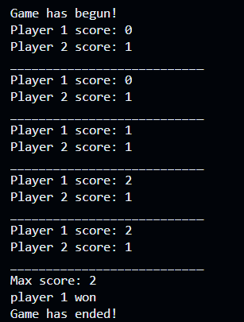
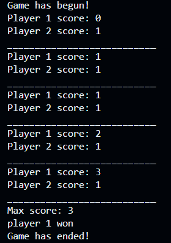

# Rock Paper Scissors 
 
Game starts and ends automatically. player 1 and player 2 exchange turns as their choices are randomly selected between rock, paper, and scissors. the winner is displayed at the end as well as their respective max score

